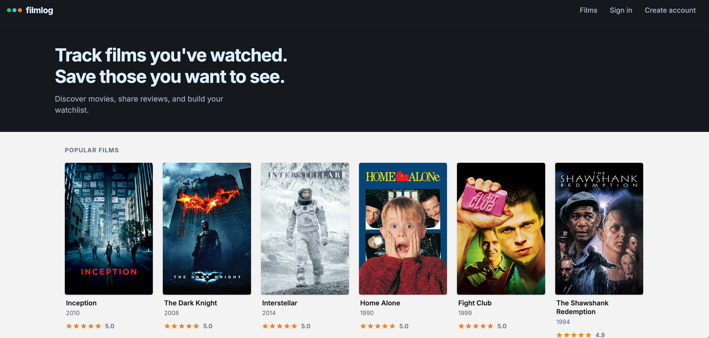
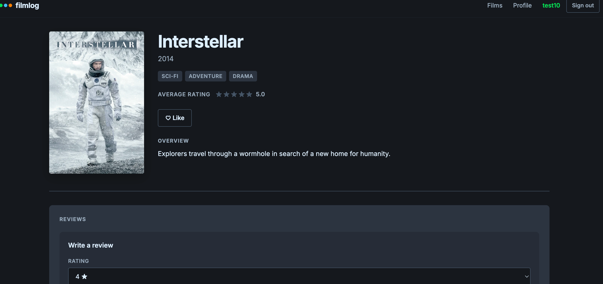
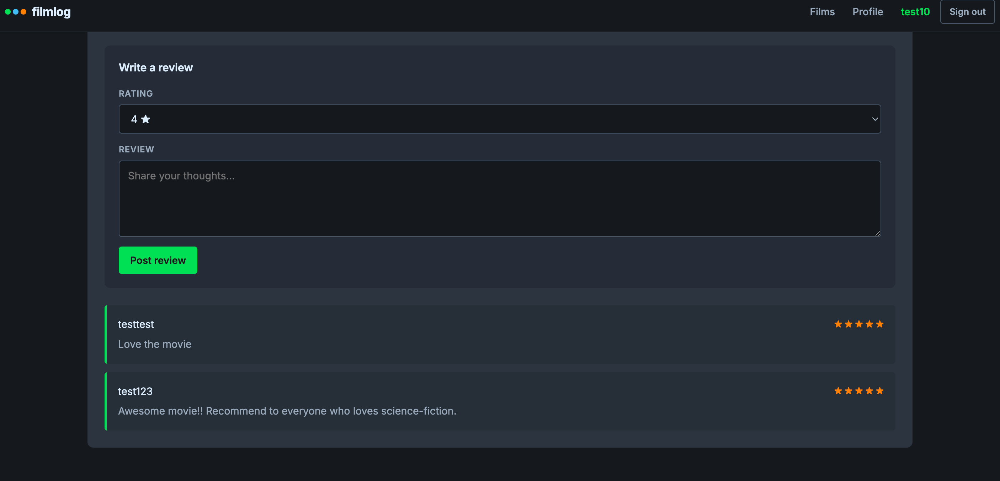

# filmlog — MERN Letterboxd Clone

A full-stack movie discovery and review app inspired by [Letterboxd](https://letterboxd.com). Browse a catalog of films, sign in, rate and review movies, and build a list of liked films on your profile.

**Live demo:** [https://mern-stack-letterboxd-clone-app-xi.vercel.app/](https://mern-stack-letterboxd-clone-app-xi.vercel.app/)

---

## Screenshots

### Home — popular films grid


### Film detail page


### Reviews


---

## Features

- **Film catalog** — browse movies with posters, years, and average ratings
- **Film details** — view genres, synopsis, and aggregated rating on `/movie/:id`
- **Authentication** — sign up, sign in, JWT-based sessions persisted in `localStorage`
- **Reviews & ratings** — logged-in users can post and update 1–5 star reviews
- **Likes / favorites** — like films from the detail page; view liked films on profile
- **Protected routes** — `/profile` requires authentication
- **Admin movie creation** — admins can add films via API (`POST /api/movies`)
- **Letterboxd-inspired UI** — dark nav, poster grid, film detail layout, loading skeletons, and shared error states

---

## Tech stack

| Layer | Technology |
|-------|------------|
| **Frontend** | React 18, TypeScript, Redux Toolkit, React Router v6 |
| **Bundler** | Webpack 5 |
| **Backend** | Node.js, Express 4, TypeScript |
| **Database** | MongoDB (Mongoose ODM) |
| **Auth** | JWT (`jsonwebtoken`), password hashing (`bcryptjs`) |
| **Deployment** | Vercel (frontend), Render (backend), MongoDB Atlas (database) |

---

## Libraries

### Frontend (`client/`)

| Library | Purpose |
|---------|---------|
| [React](https://react.dev/) | UI components and rendering |
| [React DOM](https://react.dev/) | DOM mounting |
| [Redux Toolkit](https://redux-toolkit.js.org/) | Global state (`auth`, `movies`, `reviews`, `favorites`) |
| [React Redux](https://react-redux.js.org/) | React bindings for Redux |
| [React Router DOM](https://reactrouter.com/) | Client-side routing |
| [Webpack](https://webpack.js.org/) | Module bundling |
| [Webpack Dev Server](https://webpack.js.org/configuration/dev-server/) | Local dev server with HMR |
| [Babel](https://babeljs.io/) | Transpile JSX/TS for the browser |
| [TypeScript](https://www.typescriptlang.org/) | Static typing |
| [css-loader / style-loader](https://webpack.js.org/loaders/css-loader/) | CSS imports in components |
| [html-webpack-plugin](https://webpack.js.org/plugins/html-webpack-plugin/) | HTML template injection |

### Backend (`server/`)

| Library | Purpose |
|---------|---------|
| [Express](https://expressjs.com/) | HTTP API server |
| [Mongoose](https://mongoosejs.com/) | MongoDB models and queries |
| [jsonwebtoken](https://github.com/auth0/node-jsonwebtoken) | JWT sign/verify |
| [bcryptjs](https://github.com/dcodeIO/bcrypt.js) | Password hashing |
| [cors](https://github.com/expressjs/cors) | Cross-origin requests (local + Vercel) |
| [dotenv](https://github.com/motdotla/dotenv) | Environment variable loading |
| [express-validator](https://express-validator.github.io/) | Request validation |
| [express-async-handler](https://github.com/davidbanham/express-async-handler) | Async route error handling |
| [ts-node-dev](https://github.com/wclr/ts-node-dev) | Dev server with hot reload |
| [TypeScript](https://www.typescriptlang.org/) | Static typing |

---

## Project structure

```
mern-stack-kinda-letterboxd-app/
├── client/                 # React frontend
│   ├── src/
│   │   ├── components/     # Navbar, MovieList, ReviewSection, etc.
│   │   ├── pages/          # Home, DetailedMovie, Login, Profile, …
│   │   ├── redux/          # Store, slices, hooks
│   │   ├── config/         # API URL helpers
│   │   └── styles/         # CSS per feature
│   └── vercel.json         # Vercel SPA + build config
├── server/                 # Express API
│   ├── controllers/
│   ├── models/             # User, Movie, Review
│   ├── routes/
│   ├── middleware/         # Auth, validation, errors
│   ├── scripts/            # seedMovies.ts
│   └── data/               # Sample film seed data
├── media/                  # Project screenshots for README
└── package.json            # Root scripts (install-all, seed, …)
```

---

## Getting started (local)

### Prerequisites

- Node.js 18+
- npm
- MongoDB Atlas cluster (or local MongoDB)

### 1. Clone and install

```bash
git clone https://github.com/onurrbl/mern-stack-letterboxd-clone-app.git
cd mern-stack-letterboxd-clone-app
npm run install-all
```

### 2. Server environment

```bash
cd server
cp .env.example .env
```

Edit `server/.env`:

```env
MONGO_URI=mongodb+srv://<user>:<password>@<cluster>/<dbname>?retryWrites=true&w=majority
JWT_SECRET=your-long-random-secret
PORT=5001
ADMIN_EMAIL=admin@example.com
CLIENT_URL=http://localhost:3001
```

Users who sign up with `ADMIN_EMAIL` receive admin privileges (`isAdmin: true`).

### 3. Seed sample movies (optional)

From the project root:

```bash
npm run seed:movies
```

### 4. Run the app

**Terminal 1 — API:**

```bash
npm run server:dev
```

**Terminal 2 — frontend:**

```bash
npm run client:start
```

- Frontend: [http://localhost:3001](http://localhost:3001)
- API: [http://localhost:5001](http://localhost:5001)

---

## Environment variables

### Server (`server/.env`)

| Variable | Description |
|----------|-------------|
| `MONGO_URI` | MongoDB connection string |
| `JWT_SECRET` | Secret for signing JWTs |
| `PORT` | API port (default `5001`) |
| `ADMIN_EMAIL` | Email granted admin on signup |
| `CLIENT_URL` | Comma-separated allowed CORS origins |

### Client (build time)

| Variable | Description |
|----------|-------------|
| `API_URL` | Backend base URL, e.g. `http://localhost:5001` |
| `NODE_ENV` | Set to `production` for optimized builds |

See `client/.env.example` and `server/.env.example`.

---

## API overview

Base URL (local): `http://localhost:5001/api`

### Users — `/api/users`

| Method | Route | Auth | Description |
|--------|-------|------|-------------|
| `POST` | `/` | No | Register |
| `POST` | `/login` | No | Login |
| `GET` | `/me` | Yes | Current user |
| `GET` | `/me/favorites` | Yes | Liked films |

### Movies — `/api/movies`

| Method | Route | Auth | Description |
|--------|-------|------|-------------|
| `GET` | `/` | No | List all films |
| `GET` | `/:id` | No | Film by ID |
| `POST` | `/` | Admin | Create film |
| `POST` | `/:id/favorite` | Yes | Toggle like |

### Reviews — `/api/reviews`

| Method | Route | Auth | Description |
|--------|-------|------|-------------|
| `GET` | `/movie/:movieId` | No | Reviews for a film |
| `POST` | `/` | Yes | Create review |
| `PUT` | `/:id` | Yes | Update own review |
| `DELETE` | `/:id` | Yes | Delete own review |

Protected routes expect header: `Authorization: Bearer <token>`

---

## Deployment

| Service | Role | URL |
|---------|------|-----|
| **Vercel** | React static frontend | [mern-stack-letterboxd-clone-app-xi.vercel.app](https://mern-stack-letterboxd-clone-app-xi.vercel.app/) |
| **Render** | Express API | `https://mern-stack-letterboxd-clone-app.onrender.com` |
| **MongoDB Atlas** | Database | M0 free cluster |

### Vercel (frontend)

- **Root directory:** `client`
- **Build command:** `npm run build`
- **Output directory:** `build`
- **Env:** `API_URL=https://mern-stack-letterboxd-clone-app.onrender.com`

### Render (backend)

- **Root directory:** `server`
- **Build command:** `npm install && npm run build`
- **Start command:** `npm start`
- **Env:** `MONGO_URI`, `JWT_SECRET`, `ADMIN_EMAIL`, `CLIENT_URL` (include your Vercel URL)

### MongoDB Atlas

- Allow network access from `0.0.0.0/0` (or Render IPs) so the API can connect.

> **Note:** Render’s free tier sleeps after inactivity; the first request after idle may take 30–60 seconds.

---

## Available scripts

| Command | Description |
|---------|-------------|
| `npm run install-all` | Install client and server dependencies |
| `npm run client:start` | Start frontend dev server (port 3001) |
| `npm run client:build` | Production frontend build |
| `npm run server:dev` | Start API with hot reload |
| `npm run seed:movies` | Seed sample films into MongoDB |

---

## Future improvements

- Search and filter films
- Separate watchlist vs. liked films
- User avatars
- Edit/delete review UI on the frontend
- Pagination for large catalogs

See [TODO.md](TODO.md) for the completed feature checklist.

---

## Author

Built by [onurrbl](https://github.com/onurrbl).

## License

MIT (frontend). See individual package licenses for dependencies.
